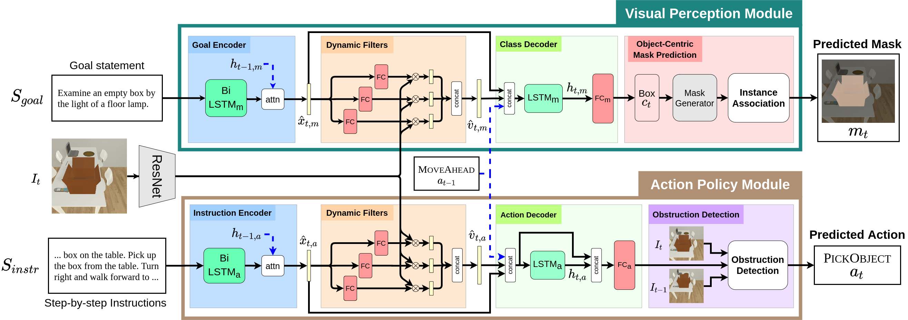

# MOCA
<a href=""> <b> MOCA: A Modular Object-Centric Approach for Interactive Instruction Following </b> </a>
 
<a href="https://kunalmessi10.github.io/"> Kunal Pratap Singh* </a>,
<a href="https://www.linkedin.com/in/suvaansh-bhambri-1784bab7/"> Suvaansh Bhambri* </a>,
<a href=""> Byeonghwi Kim* </a>,
<a href="http://roozbehm.info/"> Roozbeh Mottaghi </a>,
<a href="http://ppolon.github.io/"> Jonghyun Choi </a>

<b> MOCA </b> (<b>M</b>odular <b>O</b>bject-<b>C</b>entric <b>A</b>pproach) is a modular architecture that decouples a task into visual perception and action policy.
The action policy module (APM) is responsiblefor sequential action prediction, whereas the visual perception module (VPM) generates pixel-wise interaction maskfor the objects of interest for manipulation.
MOCA addresses long-horizon instruction following tasks based on egocentric RGB observations and natural language instructions on the <a href="https://github.com/askforalfred/alfred">ALFRED</a> benchmark.

